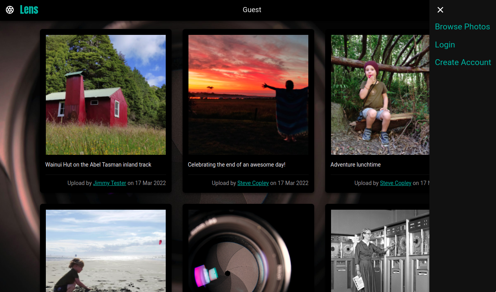

# Demo Project - Photo Portfolio with User Accounts

Demonstrates: 

- Creation of user accounts (with hashed & salted passwords)
- Logging in / out
- Use of session data
- Adaption of UI based on login status
- Some CRUD functionality:
   - Creation of new photos
   - Reading of existing photo info
   - (No updating of photos)
   - (No deletion of photos)
- Relational DB queries
   - Queries from individual tables
   - Queries with JOINs from both
- Uploading and storing of images
   - Stored in a server folder (write permissions required)
   - URL only stored in DB
   - Ability to mark photos as private

Site has a simple but responsive UI, including:
- mobile-first design
- top-level photo overview, with links to full view

## Screenshots

Browsing Photos

Main Menu

Photo Page

Browsing on mobile

Photo Page on Mobile

Create New Account

Login

View Own Photos (inc. Private)

Upload a Photo

